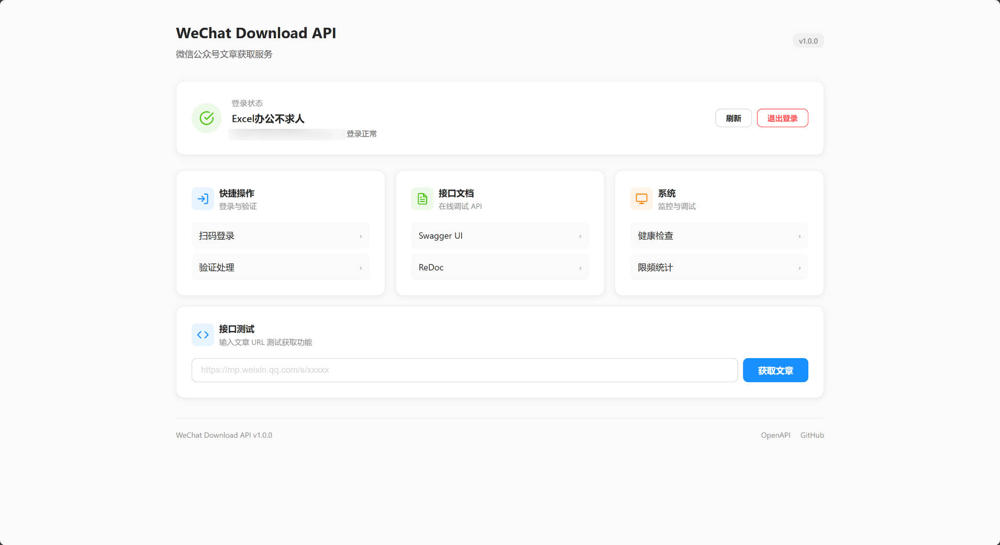

<div align="center">

# WeChat Download API

### 微信公众号文章获取 API 服务

**扫码登录 | 文章抓取 | 公众号搜索 | 一键部署**

[](https://github.com/tmwgsicp/wechat-download-api/stargazers)
[](LICENSE)
[](https://www.python.org/)
[](https://fastapi.tiangolo.com/)

</div>

---

## 功能特性

- **文章内容获取** — 通过 URL 获取文章完整内容（标题、作者、正文、图片）
- **文章列表** — 获取任意公众号历史文章列表，支持分页
- **文章搜索** — 在指定公众号文章中按关键词搜索
- **公众号搜索** — 搜索公众号并获取 FakeID
- **图片代理** — 代理微信 CDN 图片，解决防盗链问题
- **扫码登录** — 微信公众平台扫码登录，凭证自动保存
- **自动限频** — 内置三层限频机制（全局/IP/文章间隔），防止触发微信风控
- **Webhook 通知** — 登录过期、触发验证等事件自动推送
- **API 文档** — 自动生成 Swagger UI，在线调试所有接口

<div align="center">
  
  <p><em>管理面板 — 登录状态、接口文档、在线测试一站式管理</em></p>
</div>

---

## 使用前提

> 本工具需要通过微信公众平台后台的登录凭证来调用接口，因此使用前需要：

1. **拥有一个微信公众号**（订阅号、服务号均可）
2. 部署并启动服务后，访问登录页面用**公众号管理员微信**扫码登录
3. 登录成功后凭证自动保存到 `.env` 文件，有效期约 **4 天**，过期后需重新扫码

登录后即可通过 API 获取**任意公众号**的公开文章（不限于自己的公众号）。

---

## 快速开始

### 方式一：一键启动（推荐）

**Windows：**
```bash
start.bat
```

**Linux / macOS：**
```bash
chmod +x start.sh
./start.sh
```

脚本会自动完成环境检查、虚拟环境创建、依赖安装和服务启动。

> Linux 生产环境可使用 `sudo bash start.sh` 自动配置 systemd 服务和开机自启。

### 方式二：手动安装

```bash
# 创建虚拟环境
python -m venv venv
source venv/bin/activate  # Linux/macOS
# venv\Scripts\activate   # Windows

# 安装依赖
pip install -r requirements.txt

# 启动
python app.py
```

### 访问服务

| 地址 | 说明 |
|------|------|
| http://localhost:5000 | 管理面板 |
| http://localhost:5000/login.html | 扫码登录 |
| http://localhost:5000/api/docs | Swagger API 文档 |
| http://localhost:5000/api/health | 健康检查 |

---

## API 接口

### 获取文章内容

`POST /api/article` — 解析微信公众号文章，返回标题、正文、图片等结构化数据

| 参数 | 类型 | 必填 | 说明 |
|------|------|------|------|
| `url` | string | 是 | 微信文章链接（`https://mp.weixin.qq.com/s/...`） |

请求示例：

```bash
curl -X POST http://localhost:5000/api/article \
  -H "Content-Type: application/json" \
  -d '{"url": "https://mp.weixin.qq.com/s/xxxxx"}'
```

返回字段：`title` 标题、`content` HTML 正文、`plain_content` 纯文本正文、`author` 作者、`publish_time` 发布时间戳、`images` 图片列表

### 搜索公众号

`GET /api/public/searchbiz` — 按关键词搜索微信公众号，获取 FakeID

| 参数 | 类型 | 必填 | 说明 |
|------|------|------|------|
| `query` | string | 是 | 搜索关键词（公众号名称） |

请求示例：

```bash
curl "http://localhost:5000/api/public/searchbiz?query=公众号名称"
```

返回字段：`list[]` 公众号列表，每项包含 `fakeid`、`nickname`、`alias`、`round_head_img`

### 获取文章列表

`GET /api/public/articles` — 获取指定公众号的文章列表，支持分页

| 参数 | 类型 | 必填 | 说明 |
|------|------|------|------|
| `fakeid` | string | 是 | 目标公众号的 FakeID（从搜索接口获取） |
| `begin` | int | 否 | 偏移量，默认 `0` |
| `count` | int | 否 | 获取数量，默认 `10`，最大 `100` |
| `keyword` | string | 否 | 在该公众号内搜索关键词 |

请求示例：

```bash
# 获取前 50 篇
curl "http://localhost:5000/api/public/articles?fakeid=YOUR_FAKEID&begin=0&count=50"

# 获取第 51-100 篇
curl "http://localhost:5000/api/public/articles?fakeid=YOUR_FAKEID&begin=50&count=50"
```

### 搜索公众号文章

`GET /api/public/articles/search` — 在指定公众号内按关键词搜索文章

| 参数 | 类型 | 必填 | 说明 |
|------|------|------|------|
| `fakeid` | string | 是 | 目标公众号的 FakeID |
| `query` | string | 是 | 搜索关键词 |
| `begin` | int | 否 | 偏移量，默认 `0` |
| `count` | int | 否 | 获取数量，默认 `10`，最大 `100` |

请求示例：

```bash
curl "http://localhost:5000/api/public/articles/search?fakeid=YOUR_FAKEID&query=关键词"
```

### 其他接口

| 方法 | 路径 | 说明 |
|------|------|------|
| `GET` | `/api/image?url=IMG_URL` | 图片代理（仅限微信 CDN 域名） |
| `GET` | `/api/health` | 健康检查 |
| `GET` | `/api/stats` | 限频统计 |
| `POST` | `/api/login/session/{id}` | 初始化登录会话 |
| `GET` | `/api/login/getqrcode` | 获取登录二维码 |
| `GET` | `/api/login/scan` | 检查扫码状态 |
| `POST` | `/api/login/bizlogin` | 完成登录 |
| `GET` | `/api/login/info` | 获取登录信息 |
| `GET` | `/api/admin/status` | 查询登录状态 |
| `POST` | `/api/admin/logout` | 退出登录 |

完整的接口文档请访问 http://localhost:5000/api/docs

---

## 配置说明

复制 `env.example` 为 `.env`，登录后凭证会自动保存：

```bash
cp env.example .env
```

| 配置项 | 说明 | 默认值 |
|--------|------|--------|
| `WECHAT_TOKEN` | 微信 Token（登录后自动填充） | - |
| `WECHAT_COOKIE` | 微信 Cookie（登录后自动填充） | - |
| `WECHAT_FAKEID` | 公众号 FakeID（登录后自动填充） | - |
| `WEBHOOK_URL` | Webhook 通知地址（可选） | 空 |
| `RATE_LIMIT_GLOBAL` | 全局每分钟请求上限 | 10 |
| `RATE_LIMIT_PER_IP` | 单 IP 每分钟请求上限 | 5 |
| `RATE_LIMIT_ARTICLE_INTERVAL` | 文章请求最小间隔（秒） | 3 |
| `PORT` | 服务端口 | 5000 |

---

## 项目结构

```
├── app.py                # FastAPI 主应用
├── requirements.txt      # Python 依赖
├── env.example           # 环境变量示例
├── routes/               # API 路由
│   ├── article.py        # 文章内容获取
│   ├── articles.py       # 文章列表
│   ├── search.py         # 公众号搜索
│   ├── login.py          # 扫码登录
│   ├── admin.py          # 管理接口
│   ├── image.py          # 图片代理
│   ├── health.py         # 健康检查
│   └── stats.py          # 统计信息
├── utils/                # 工具模块
│   ├── auth_manager.py   # 认证管理
│   ├── helpers.py        # HTML 解析
│   ├── rate_limiter.py   # 限频器
│   └── webhook.py        # Webhook 通知
└── static/               # 前端页面
```

---

## 常见问题

<details>
<summary><b>提示"服务器未登录"</b></summary>

访问 http://localhost:5000/login.html 扫码登录，凭证会自动保存到 `.env`。
</details>

<details>
<summary><b>触发微信风控 / 需要验证</b></summary>

1. 在浏览器中打开提示的文章 URL 完成验证
2. 等待 30 分钟后重试
3. 降低请求频率（系统已内置自动限频）
</details>

<details>
<summary><b>如何获取公众号的 FakeID</b></summary>

调用搜索接口：`GET /api/public/searchbiz?query=公众号名称`，从返回结果的 `fakeid` 字段获取。
</details>

<details>
<summary><b>Token 多久过期</b></summary>

Cookie 登录有效期约 4 天，过期后需重新扫码登录。配置 `WEBHOOK_URL` 可以在过期时收到通知。
</details>

<details>
<summary><b>可以同时登录多个公众号吗</b></summary>

当前版本不支持多账号。建议部署多个实例，每个登录不同公众号。
</details>

---

## 技术栈

| 层级 | 技术 |
|------|------|
| **Web 框架** | FastAPI |
| **ASGI 服务器** | Uvicorn |
| **HTTP 客户端** | HTTPX |
| **配置管理** | python-dotenv |
| **运行环境** | Python 3.8+ |

---

## 开源协议

本项目采用 **AGPL 3.0** 协议开源。

| 使用场景 | 是否允许 |
|---------|---------|
| 个人学习和研究 | 允许，免费使用 |
| 企业内部使用 | 允许，免费使用 |
| 修改代码内部使用 | 允许，免费使用 |
| 修改后对外提供网络服务 | 需开源修改后的代码 |
| 集成到产品中销售 | 需开源或取得商业授权 |

> **AGPL 3.0 核心要求**：修改代码并通过网络提供服务时，必须公开源代码。

详见 [LICENSE](LICENSE) 文件。

### 免责声明

- 本软件按"原样"提供，不提供任何形式的担保
- 本项目仅供学习和研究目的，请遵守微信公众平台相关服务条款
- 使用者对自己的操作承担全部责任
- 因使用本软件导致的任何损失，开发者不承担责任

---

## 参与贡献

由于个人精力有限，目前**暂不接受 PR**，但非常欢迎：

- **提交 Issue** — 报告 Bug、提出功能建议
- **Fork 项目** — 自由修改和定制
- **Star 支持** — 给项目点 Star，让更多人看到

---

## 联系方式

<table>
  <tr>
    <td align="center">
      <br>
      <b>个人微信</b><br>
      <em>技术交流 · 商务合作</em>
    </td>
    <td align="center">
      <br>
      <b>赞赏支持</b><br>
      <em>开源不易，感谢支持</em>
    </td>
  </tr>
</table>

- **GitHub Issues**: [提交问题](https://github.com/tmwgsicp/wechat-download-api/issues)

---

## 致谢

- [FastAPI](https://fastapi.tiangolo.com/) — 高性能 Python Web 框架
- [HTTPX](https://www.python-httpx.org/) — 现代化 HTTP 客户端

---

<div align="center">

**如果觉得项目有用，请给个 Star 支持一下！**

[](https://star-history.com/#tmwgsicp/wechat-download-api&Date)

Made with ❤️ by [tmwgsicp](https://github.com/tmwgsicp)

</div>
